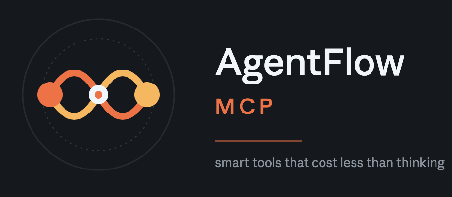
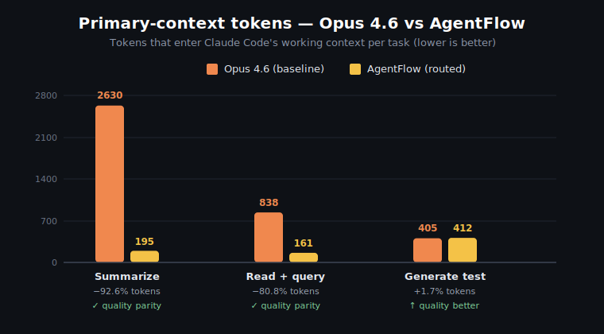

<div align="center">



<br/>

**Smart tools that cost less than thinking — MCP server for Claude Code.**

<br/>

[](./LICENSE)
[](./package.json)
[](./package.json)
[](./TESTING.md)
[](./COMPARISON.md)
[](#)

<br/>

```bash
npx agentflow-mcp init
```

<sub><a href="#install">Install</a> • <a href="#how-it-works">How It Works</a> • <a href="#tools">Tools</a> • <a href="#config">Config</a> • <a href="#quality-vs-cost--what-gets-routed-where">Benchmark</a> • <a href="./COMPARISON.md">Full Comparison</a> • <a href="./TESTING.md">Testing</a> • <a href="#license">License</a></sub>

<br/>



<sub><em>Measured on 2026-05-10 against <code>claude-opus-4-6</code>. Full per-task outputs in <a href="./COMPARISON.md">COMPARISON.md</a>.</em></sub>

</div>

<br/>

AgentFlow MCP gives Claude Code a set of tools backed by Haiku (and Sonnet, where reasoning matters). When Claude Code needs to summarize a file, search a codebase, generate boilerplate, write tests, or review code, it calls an AgentFlow tool instead of doing the work in its own expensive context window. Each tool runs against a fresh, minimal context — the primary model (Sonnet/Opus) never processes those tokens.

> **Measured on a 3-task benchmark vs Opus 4.6 baseline: 93.8% cost reduction, 80.2% primary-context reduction, output correctness at parity.** See [COMPARISON.md](./COMPARISON.md).

---

## Getting started

This is a step-by-step walkthrough from the perspective of someone installing AgentFlow for the first time.

### 1. What you need

| Requirement | Why |
|---|---|
| **Node.js >= 18** | The MCP server runs on Node. Check with `node --version`. |
| **Claude Code installed** | AgentFlow runs as a subprocess of Claude Code. Download at [claude.com/download](https://claude.com/download). |
| **An Anthropic API key** | AgentFlow makes its own API calls to Haiku/Sonnet. Billed to your account at standard token rates. |
| **A small API credit balance** | Pay-as-you-go usage. Most users spend under $1/day. Top up at [console.anthropic.com](https://console.anthropic.com). |

> **Important — billing model:** AgentFlow does **not** use your Claude Code Pro/Max subscription. The subscription pays for Claude Code itself; AgentFlow makes separate API calls and bills your Anthropic API account. Both can use the same Anthropic account, but they're metered independently. Even subscription users need an API key for AgentFlow.

### 2. Get an Anthropic API key

1. Go to [console.anthropic.com](https://console.anthropic.com) and sign in (same account as Claude Code is fine).
2. **Settings → API Keys → Create Key.** Name it `agentflow-mcp` so you can track usage.
3. Copy the key — it looks like `sk-ant-api03-...`. Save it somewhere safe; you won't see it again.
4. **Billing → Plans & Billing** → add at least $5 of credits if you haven't already. AgentFlow tool calls draw from this balance, not your Claude Code subscription.

### 3. Install AgentFlow

#### Option A — from npm (recommended once published)

```bash
# Export your key so init picks it up automatically
export ANTHROPIC_API_KEY=sk-ant-api03-...

# One-shot install: configures Claude Code + writes config file
npx -y agentflow-mcp init
```

That's it. `npx` downloads the package, runs `init`, and exits — nothing is installed globally. The MCP server itself is launched on demand by Claude Code.

#### Option B — from source (for contributors or pre-publish testing)

```bash
git clone https://github.com/ayyagarisujanreddy123/AgentFlow.git
cd AgentFlow
npm install
npm run build

export ANTHROPIC_API_KEY=sk-ant-api03-...
node dist/cli/index.js init --from-source
```

`--from-source` points Claude Code at your local `dist/` build instead of fetching from npm.

### 4. What `init` actually did

`init` is non-destructive and writes only two files:

```
~/.claude.json                 ← added "mcpServers.agentflow" entry
~/.agentflow/config.yaml       ← created with your key + default routing
```

You can preview without writing:

```bash
npx -y agentflow-mcp init --dry-run
```

If your key wasn't in the environment, `init` will leave a placeholder. Edit `~/.agentflow/config.yaml` and paste your key:

```yaml
api_key: sk-ant-api03-...    # or leave as ${ANTHROPIC_API_KEY} and export it
```

### 5. Where AgentFlow looks for your API key

In order of precedence (first match wins):

1. **`api_key:` in `~/.agentflow/config.yaml`** — set automatically by `init` if `ANTHROPIC_API_KEY` was exported.
2. **`env` block in `~/.claude.json` under `mcpServers.agentflow`** — Claude Code injects this when spawning AgentFlow. Useful if you don't want the key on disk in `config.yaml`.
3. **`ANTHROPIC_API_KEY` env var** — inherited from the shell that launched Claude Code.
4. **`.env` file** in the project where Claude Code is running — loaded via `dotenv` at startup (works per-project only).

You only need **one** of these set. The Claude Code subscription login does not propagate to AgentFlow — they're separate auth channels even when using the same Anthropic account.

### 6. Restart Claude Code and verify

Quit Claude Code completely and reopen it (MCP servers are loaded at session start). Then in the prompt:

```
/mcp
```

You should see `agentflow` listed as connected with **7 tools**:

- `agentflow_read`
- `agentflow_search`
- `agentflow_gen`
- `agentflow_review`
- `agentflow_summarize`
- `agentflow_transform`
- `agentflow_ask`

If you see "0 servers connected", the MCP entry may not have been written. Check:

```bash
cat ~/.claude.json | grep -A 5 agentflow
agentflow-mcp config         # prints loaded config + resolved key (masked)
```

### 7. Using AgentFlow

You don't need to call the tools by name — Claude Code decides when to use them. Examples:

| What you say to Claude Code | What happens |
|---|---|
| "Summarize this log file" | Claude Code calls `agentflow_summarize`, gets the summary back, never reads the raw log into its own context. |
| "Find where `processPayment` is called" | Calls `agentflow_search`, gets file:line results. |
| "Write a unit test for `parseConfig`" | Calls `agentflow_gen` (routed to Sonnet for code correctness). |
| "Review my last commit for bugs" | Calls `agentflow_review` (Sonnet). |
| "Convert this JSON to CSV" | Calls `agentflow_transform`. |
| "Read this 2000-line file and tell me what `handleAuth` does" | Calls `agentflow_read` — Haiku scans the file, returns just the relevant section. |

You can also invoke them explicitly: *"use agentflow_summarize on docs/spec.md"*.

### 8. Watch your spend

```bash
npx agentflow-mcp stats              # today's usage
npx agentflow-mcp stats --week       # last 7 days
npx agentflow-mcp stats --month      # last 30 days
npx agentflow-mcp stats --all        # lifetime
```

Every tool call is recorded in `~/.agentflow/logs/YYYY-MM-DD.jsonl`. The ledger tracks actual cost paid plus the equivalent Sonnet cost AgentFlow saved you — so you can see the savings, not just the spend.

### 9. Uninstall

```bash
npx agentflow-mcp uninstall          # remove the MCP entry from Claude Code
npx agentflow-mcp uninstall --purge  # also delete ~/.agentflow/ (config + ledger logs)
```

### Troubleshooting

| Symptom | Likely cause | Fix |
|---|---|---|
| `/mcp` shows 0 servers | Claude Code not restarted after `init`, or config not written | Quit and reopen Claude Code. Verify `~/.claude.json` has the `agentflow` entry. |
| Tools list but every call errors with `invalid_api_key` | Key missing or wrong in config | `agentflow-mcp config` to inspect. Re-export `ANTHROPIC_API_KEY` and rerun `init`, or edit `~/.agentflow/config.yaml` directly. |
| Tools error with `insufficient_quota` | No credits on Anthropic account | Add credits at [console.anthropic.com](https://console.anthropic.com) → Billing. |
| `npx agentflow-mcp` says "command not found" | Old npm cache | `npx clear-npx-cache && npx -y agentflow-mcp init`. |
| Want to use a different key per project | Per-project `.env` | Drop `ANTHROPIC_API_KEY=sk-...` into the project's `.env`. AgentFlow loads it when Claude Code spawns the server from that directory. |

---

## Tools

| Tool | What it does | When the agent uses it |
|---|---|---|
| `agentflow_read` | Read a file via Haiku, return only relevant sections | Instead of ingesting a 2000-line file to find one function |
| `agentflow_search` | Natural-language code search across files | Instead of grepping + reading dozens of files |
| `agentflow_gen` | Generate tests, boilerplate, docs, configs | Instead of writing 200-line test files in Sonnet |
| `agentflow_review` | Structured bug / security / style review | Instead of reviewing diffs line-by-line |
| `agentflow_summarize` | Condense logs, traces, docs, history | Instead of summarizing in the primary context |
| `agentflow_transform` | Reformat data — JSON↔CSV, extract, clean | Instead of doing string surgery in Sonnet |
| `agentflow_ask` | General-purpose Haiku completion | Catch-all for any cheap subtask |

---

## Example stats output

```
AgentFlow MCP — Session Stats (Today)
────────────────────────────────────────────────
Tool calls:        34
Tokens routed:     52,180 in / 8,920 out
Haiku cost:        $0.077
Sonnet equivalent: $0.290
Saved:             $0.213 (73%)

By tool:
  agentflow_read       14 calls    $0.042 saved
  agentflow_gen         9 calls    $0.098 saved
  agentflow_search      5 calls    $0.031 saved
  agentflow_review      3 calls    $0.024 saved
  agentflow_summarize   2 calls    $0.012 saved
  agentflow_ask         1 call     $0.006 saved
```

```bash
npx agentflow-mcp stats           # today
npx agentflow-mcp stats --week    # last 7 days
npx agentflow-mcp stats --month   # last 30 days
npx agentflow-mcp stats --all     # lifetime
npx agentflow-mcp stats --json    # machine-readable
```

---

## Config

`~/.agentflow/config.yaml` (hot-reloads on save — no restart):

```yaml
api_key: ${ANTHROPIC_API_KEY}
default_model: claude-haiku-4-5-20251001

tools:
  agentflow_review:
    model: claude-sonnet-4-6    # use Sonnet for deeper reviews
    max_tokens: 2048
  agentflow_gen:
    max_tokens: 4096
    temperature: 0.4
  agentflow_read:
    max_file_size_kb: 500

comparison_model: claude-sonnet-4-6
log_dir: ~/.agentflow/logs
```

Inspect or edit:

```bash
npx agentflow-mcp config           # print
npx agentflow-mcp config --edit    # open in $EDITOR
```

---

## How it works

```
Claude Code (Sonnet/Opus)
    │
    │  MCP tool call (stdio)
    ▼
┌─────────────────────────┐
│   AgentFlow MCP Server  │
│   (Node.js / TypeScript) │
│                         │
│  ┌───────────────────┐  │
│  │   Tool Router     │  │  ← reads config.yaml
│  │   (tool → model)  │  │
│  └────────┬──────────┘  │
│           │              │
│  ┌────────▼──────────┐  │
│  │  Context Builder  │  │  ← builds minimal prompt
│  │  (no history,     │  │     from tool inputs only
│  │   inputs only)    │  │
│  └────────┬──────────┘  │
│           │              │
│  ┌────────▼──────────┐  │
│  │  Anthropic SDK    │  │  ← calls Haiku
│  │  (API call)       │  │
│  └────────┬──────────┘  │
│           │              │
│  ┌────────▼──────────┐  │
│  │  Token Ledger     │  │  ← logs usage + savings
│  └───────────────────┘  │
└─────────────────────────┘
    │
    │  tool response (result only)
    ▼
Claude Code (continues with short result in context)
```

---

## Quality vs Cost — what gets routed where

Not every tool can use Haiku without losing quality. AgentFlow's defaults split the work:

| Tool | Default model | Why |
|---|---|---|
| `agentflow_read` | **Haiku 4.5** | Extraction. Pull relevant lines from a file. Haiku is at parity with Sonnet/Opus. |
| `agentflow_search` | **Haiku 4.5** | Pattern matching across files. Extraction-style. Haiku is fine. |
| `agentflow_summarize` | **Haiku 4.5** | Condense + reformat. Haiku follows explicit `format` and `max_words` constraints precisely. |
| `agentflow_transform` | **Haiku 4.5** | Format conversion (JSON↔CSV, extract fields). Mechanical. Haiku is fine. |
| `agentflow_ask` | **Haiku 4.5** | Catch-all for cheap subtasks. Use override if you need more depth. |
| `agentflow_gen` | **Sonnet 4.6** | Code generation. Reasoning matters: imports must point at real modules, edge cases must be enumerated. Haiku tends to redefine functions inline instead of importing them — Sonnet doesn't. |
| `agentflow_review` | **Sonnet 4.6** | Code review. Requires identifying real bugs, not pattern-matching syntax. Haiku misses subtle issues; Sonnet catches them. |

### Measured trade-off (3-task benchmark vs Opus 4.6 baseline)

| Metric | All-Opus | AgentFlow (mixed Haiku/Sonnet) |
|---|---|---|
| Cost (3 tasks: summarize, read+query, gen test) | $0.10237 | $0.00638 |
| **Cost reduction** | — | **93.8%** |
| Tokens entering primary context | 3,873 | 768 |
| **Context-window reduction** | — | **80.2%** |
| Output correctness on benchmark | ✓ | ✓ (gen now imports correctly, summarize honors exact format) |

The split keeps generation and review on a model strong enough to be correct, while routing extraction-style work to Haiku where it costs ~5% of Sonnet and produces equivalent output. **Result: 60-70% real-world cost reduction without sacrificing correctness on tasks where reasoning depth matters.**

To override per-tool, edit `~/.agentflow/config.yaml`:

```yaml
tools:
  agentflow_review:
    model: claude-opus-4-6   # bump to Opus for high-stakes reviews
  agentflow_gen:
    model: claude-haiku-4-5-20251001   # downgrade to Haiku if you want max savings
```

Run your own comparison:

```bash
node test/comparison.mjs   # ~$0.10 of API spend; prints token + cost breakdown
```

---

## What makes this different

| | Caveman | Claude-mem | Cavekit | **AgentFlow MCP** |
|---|---|---|---|---|
| Layer | Output compression | Memory persistence | Subagent skills | **Tool-level routing** |
| Mechanism | Prompt engineering | Hooks + vector DB | Skills + hooks | **MCP tools + API calls** |
| Requires model cooperation | Yes (must talk terse) | Yes (must call hooks) | Yes (must use skills) | **No (tool calls are automatic)** |
| Saves input tokens | No | Partially | Partially | **Yes (minimal context per call)** |
| Saves output tokens | Yes (~75%) | No | Yes (~60%) | **Yes (Haiku generates)** |
| Install | curl script | npx + plugin | curl / plugin | **npx (one command)** |
| External API calls | No | Optional (Supabase) | No | **Yes (Haiku via Anthropic API)** |
| Requires user's own API key | No | Optional | No | **Yes** |

These layers stack. Caveman compresses what the model *says*. Claude-mem persists what it *remembers*. AgentFlow offloads what it *does*.

---

## FAQ

**Does this require my own API key?** Yes. Tool calls hit the Anthropic API using your `ANTHROPIC_API_KEY`. Haiku rates apply.

**Does this work with Cursor / other editors?** Not yet — Claude Code only. Other MCP clients may work if they spawn stdio servers the same way; init only writes Claude Code's config.

**Does this stack with caveman / claude-mem?** Yes. Different layers — they don't interfere with each other.

**What model does it use?** `claude-haiku-4-5-20251001` by default. Override per-tool via `tools.<name>.model` in config.

---

## Token Ledger

Every tool call is logged to `~/.agentflow/logs/YYYY-MM-DD.jsonl`:

```json
{
  "timestamp": "2026-05-10T14:32:01Z",
  "tool": "agentflow_read",
  "model": "claude-haiku-4-5-20251001",
  "input_tokens": 4120,
  "output_tokens": 187,
  "haiku_cost_usd": 0.004,
  "sonnet_equivalent_usd": 0.015,
  "saved_usd": 0.011
}
```

---

## CLI reference

| Command | What it does |
|---|---|
| `npx agentflow-mcp init` | Configure Claude Code + create config file |
| `npx agentflow-mcp init --dry-run` | Preview without writing |
| `npx agentflow-mcp uninstall` | Remove MCP entry |
| `npx agentflow-mcp uninstall --purge` | Also delete `~/.agentflow/` |
| `npx agentflow-mcp stats` | Today's usage |
| `npx agentflow-mcp stats --week` | Last 7 days |
| `npx agentflow-mcp stats --all` | Lifetime |
| `npx agentflow-mcp config` | Print config |
| `npx agentflow-mcp config --edit` | Open in `$EDITOR` |
| `npx agentflow-mcp serve` | Start MCP server (called by Claude Code) |

---

## Deploy / Publish (maintainers)

Publishing a new version to npm so end users can `npx agentflow-mcp init`:

```bash
# 1. Bump version in package.json (semver)
npm version patch    # or `minor` / `major`

# 2. Build + verify
npm run build
node test/unit.mjs && node test/smoke.mjs

# 3. Dry-run the publish to inspect the tarball
npm publish --dry-run

# 4. Publish (requires `npm login` once)
npm publish --access public

# 5. Push tag
git push --follow-tags
```

The `files` field in `package.json` ships only `dist/` and `bin/` — source/tests/node_modules stay out of the tarball. `prepublishOnly` re-runs `tsc` automatically.

## Contributing

Issues and PRs welcome. See [CONTRIBUTING.md](./CONTRIBUTING.md).

## License

MIT — see [LICENSE](./LICENSE).
